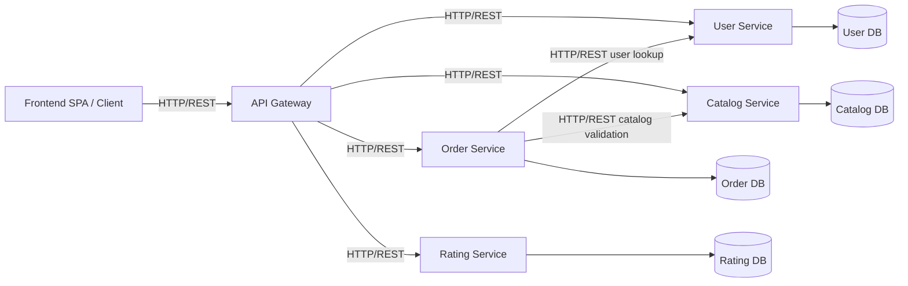

# Microservices Migration Plan

## 1. Overview & Rationale

### Why split the monolith?
- The current solution is a tightly coupled ASP.NET Core monolith with shared DB context, shared DTOs, and blended service/repository layers.
- Splitting into discrete services improves deployability, fault isolation, scaling, and team ownership.
- A synchronous HTTP/REST architecture is the fastest, lowest-risk first step for this codebase because the existing API surface is already HTTP-based.

### Target architecture
- API Gateway + service-specific ASP.NET Core microservices
- Each service owns its own data store and API boundary
- Cross-service communication is synchronous HTTP/REST via typed `HttpClientFactory`
- Shared contract package for DTOs and public request/response schemas
- Resilience via Polly policies in outbound service clients
- Gateway-level JWT authentication and authorization enforcement

---

## 2. Service Mapping Table

| Service | Current Code / Controllers | Language | Why | Owned DB Domain |
|---|---|---|---|---|
| `UserService` | `UserController`, `UserService`, `PasswordService`, `UserRepository` | C# | Authentication, user lifecycle, profile updates, login, registration | Users |
| `CatalogService` | `ProductController`, `CategoryController`, `BranchController`, `ProductService`, `CategoryService`, `BranchService`, related repos | C# | Product catalog, search, categories, branches, pricing | Products/Categories/Branches |
| `OrderService` | `OrderController`, `OrderService`, `OrderRepository` | C# | Order creation, history, status workflow, business rules | Orders/OrderItems |
| `RatingService` | `RatingService`, `RatingRepository` | C# | Rating storage / user feedback and analytics | Ratings |
| `API Gateway` | new project | C# | JWT validation, routing, request aggregation, central auth, CORS | none |
| `High-perf Utility` | optional future service | Go | Analytics stream processing, batch sync, recommendation engine | none |

> Note: The `RatingService` currently has repository/service code but no existing controller in the monolith, so its API surface must be added as part of the split.

---

## 3. Build Blockers

### Code-level issues to fix before split
1. `WebApiShop` vs `WebAPIShop` namespace mismatch
   - `OrderController` uses `namespace WebApiShop.Controllers`
   - `UserController` uses `namespace WebAPIShop.Controllers`
   - Standardize all controllers on one namespace before creating independent services.

2. `WebApiShop/Program.cs` issues
   - Duplicate `builder.Services.AddControllers();`
   - Duplicate `using StackExchange.Redis;`
   - Application startup should be cleaned before extraction.

3. Controller payload design
   - `ProductController` accepts and returns entity type `Product` instead of DTOs.
   - `UserController` should not expose domain entities directly; use shared DTO contracts.
   - `OrderController.Get(int id)` is currently a placeholder returning `"value"`.

4. Missing API surface for ratings
   - `RatingService` is registered, but there is no `RatingController` in `WebApiShop/Controllers`.
   - Add a dedicated rating API or fold it into `CatalogService` temporarily.

5. Shared contracts cleanup
   - `DTOs/DTOs.csproj` currently references infrastructure packages like `NLog` and `StackExchange.Redis`.
   - The contract layer should only contain plain DTOs, events, enums, and validation metadata.

6. Service/repository layering violations
   - `Repository/Repository.csproj` references `DTOs`, which couples persistence layer to transport contracts.
   - In a microservice split, repositories should depend only on entities and local service contracts, not monolithic DTOs.

7. Caching and configuration scope
   - `OrderService` currently uses Redis and configuration directly inside the service.
   - Cache access must become service-local or moved behind the service boundary for independent scaling.

### Project dependency blockers
- `WebApiShop.csproj` references only `Service.csproj`; it should later point to service-specific API projects.
- `Service.csproj` references `Repository` and `DTOs`; after split, only shared contracts and local repository packages should remain.
- `DTOs.csproj` should not be a dependency of `Repository` if DTOs become part of a shared contract package instead.

---

## 4. Step-by-Step Execution

### Phase 0: Preparation
1. Create a new repository folder structure under the solution root for services:
   - `/src/UserService`
   - `/src/CatalogService`
   - `/src/OrderService`
   - `/src/RatingService`
   - `/src/ApiGateway`
   - `/src/Shared.Contracts`
2. Clean the existing monolith:
   - fix namespace mismatches
   - remove duplicate DI and using statements
   - replace entity payloads with DTOs in controllers
   - implement or remove placeholder endpoints
   - add a proper `RatingController` if ratings are needed.

### Phase 1: Extract Shared Contracts
1. Move all public DTOs from `DTOs/` to `Shared.Contracts`
   - `UserReadDTO`, `UserRegisterDTO`, `UserLoginDTO`, `UserUpdateDTO`
   - `ProductDTO`, `CategoryDTO`, `BranchDTO`, `OrderCreateDTO`, `OrderReadDTO`
   - `ChangeOrderStatusDto`, `PageResponseDTO`, `Password` contract objects
2. Keep contract package infrastructure-free.
3. Add event contract classes for future service integration:
   - `OrderCreatedEvent`
   - `UserRegisteredEvent`
   - `ProductUpdatedEvent`
4. Publish `Shared.Contracts` as a project reference or package consumed by all services.

### Phase 2: Create Independent Service Projects
For each service:
1. Create a new ASP.NET Core Web API project.
2. Add a local `DbContext` and its own EF model subset.
3. Copy the relevant controller, service, repository, DTO/event contract references.
4. Remove cross-domain dependencies from the service implementation.

Service extraction order recommendation:
1. `UserService`
2. `CatalogService`
3. `OrderService`
4. `RatingService`

### Phase 3: Database Isolation
1. Replace centralized `MyWebApiShopContext` with service-specific contexts:
   - `UserDbContext` for `Users`
   - `CatalogDbContext` for `Products`, `Categories`, `Branches`
   - `OrderDbContext` for `Orders`, `OrderItems`
   - `RatingDbContext` for `Ratings`
2. Prefer separate SQL databases per service.
3. If immediate DB separation is too expensive, use separate schemas in the same database as an intermediate step.
4. Migrate data with careful schema mapping and incremental cutover.

### Phase 4: API Gateway and Auth
1. Create `ApiGateway` in ASP.NET Core.
2. Implement JWT validation at the gateway level using `Microsoft.AspNetCore.Authentication.JwtBearer`.
3. Expose only token-protected routes through the gateway:
   - `/api/users/*`
   - `/api/catalog/*`
   - `/api/orders/*`
   - `/api/ratings/*`
4. Configure CORS and common request logging there.
5. Setup route forwarding or API aggregation for composite endpoints.

### Phase 5: Cross-Service HTTP Contracts
1. Build typed `HttpClient` clients in `OrderService`:
   - `IUserServiceClient` for `GET /api/users/{userId}`
   - `ICatalogServiceClient` for `GET /api/catalog/products/{id}` and order validation
2. Use shared request/response DTOs from `Shared.Contracts`.
3. Avoid direct database calls from one service to another.

### Phase 6: Resilience and Observability
1. Add Polly policies to all outbound HTTP clients.
2. Instrument telemetry and logging at the gateway and service levels.
3. Implement health checks for each microservice.
4. Use structured logs, correlation IDs, and consistent error codes.

### Phase 7: Test & Cutover
1. Add service-level unit and integration tests.
2. Add API contract tests for gateway-to-service flows.
3. Deploy services incrementally.
4. Validate with the monolith still available until each service is fully verified.

---

## 5. Resilience & Auth

### Gateway JWT handling
- Gateway performs token validation with `JwtBearer`.
- Validate issuer, audience, expiry, signature.
- Enforce role claims and scope-based access control.
- Forward a reduced set of claims to downstream services using `Authorization` header.

Example gateway auth setup:
```csharp
builder.Services.AddAuthentication(JwtBearerDefaults.AuthenticationScheme)
    .AddJwtBearer(options =>
    {
        options.Authority = "https://auth.example.com";
        options.Audience = "api-gateway";
        options.TokenValidationParameters = new TokenValidationParameters
        {
            ValidateIssuer = true,
            ValidateAudience = true,
            ValidateLifetime = true,
            ValidateIssuerSigningKey = true
        };
    });
```

### Polly resilience policies
- `RetryPolicy`: 3 attempts with exponential backoff for transient 5xx and network failures.
- `CircuitBreakerPolicy`: break after 2 failures over 30 seconds, reset after 15 seconds.
- `TimeoutPolicy`: 2.5 second timeout for outbound service calls.
- `FallbackPolicy`: return a safe default or error payload when dependent service is unavailable.

Example named client registration:
```csharp
builder.Services.AddHttpClient<IUserServiceClient, UserServiceClient>(client =>
{
    client.BaseAddress = new Uri("https://users.api.local/");
})
.AddPolicyHandler(GetRetryPolicy())
.AddPolicyHandler(GetCircuitBreakerPolicy())
.AddPolicyHandler(GetTimeoutPolicy());
```

### Policy definitions
```csharp
IAsyncPolicy<HttpResponseMessage> GetRetryPolicy() =>
    HttpPolicyExtensions
        .HandleTransientHttpError()
        .OrResult(msg => msg.StatusCode == HttpStatusCode.RequestTimeout)
        .WaitAndRetryAsync(3, retryAttempt => TimeSpan.FromSeconds(Math.Pow(2, retryAttempt)));

IAsyncPolicy<HttpResponseMessage> GetCircuitBreakerPolicy() =>
    HttpPolicyExtensions
        .HandleTransientHttpError()
        .CircuitBreakerAsync(2, TimeSpan.FromSeconds(15));

IAsyncPolicy<HttpResponseMessage> GetTimeoutPolicy() =>
    Policy.TimeoutAsync<HttpResponseMessage>(TimeSpan.FromSeconds(2.5));
```

---

## 6. Architecture Diagram



---

## 7. Repo-Specific Callouts

- `Program.cs` is currently the single startup point; split it into one startup per service plus gateway.
- `MyWebApiShopContext` is the central EF context; extract service-specific contexts first.
- `DTOs.csproj` is currently polluted with infra dependencies; clean that contract project before sharing.
- `RatingService` is registered in DI but not exposed through a controller.
- `OrderService` cache semantics currently depend on Redis; this is okay for service-local caching but must not be used as a cross-service communication mechanism.

---

## 8. Recommended First Execution Path

1. Fix namespace and controller contract issues.
2. Extract `Shared.Contracts` and move DTO-only code there.
3. Create `UserService` and `CatalogService` from the existing monolith.
4. Build the API Gateway and make the first routing layer.
5. Split `OrderService` and add typed HTTP clients plus Polly.
6. Add `RatingService` API surface and fully isolate its DB.

> This plan preserves the current HTTP-based architecture, removes monolithic coupling, and gives a clear migration path without introducing event-driven complexity in the first phase.
